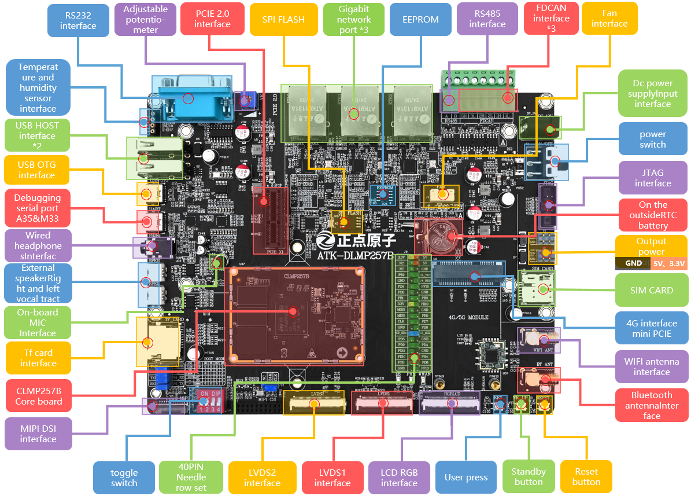
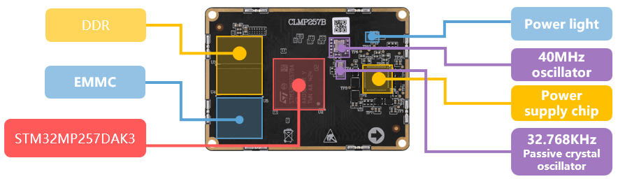
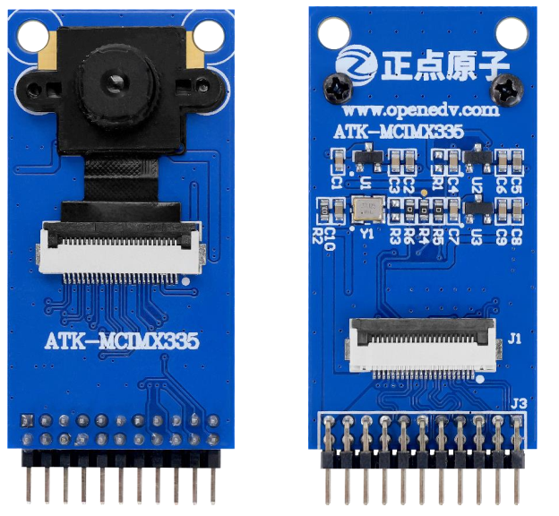
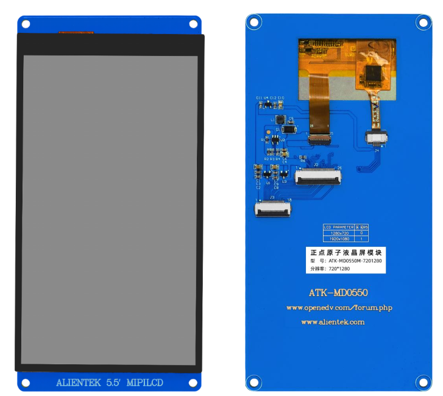
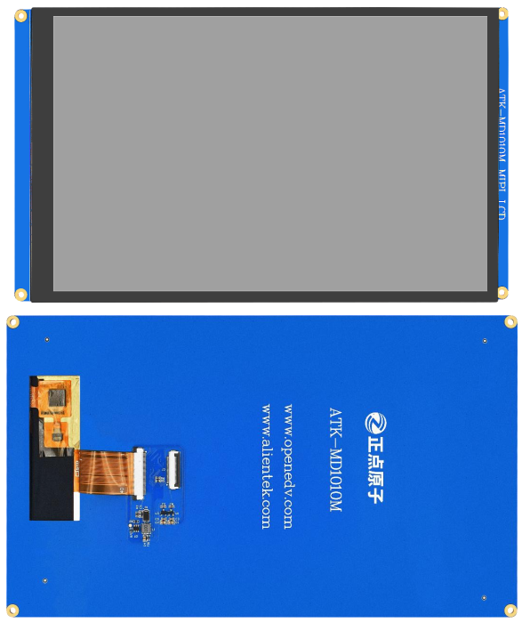

# development-board-ATK-DLMP257B

## ATK-DLMP257B development board resources

First, let's take a look at the ATK-DLMP257B development board backplane resource diagram, as shown below.

It can be seen from the above figure that the ATK-DLMP257B development board is very rich in resources, expanded with a wealth of interfaces and functional modules. The external size of the development board is 180mm*140mm, and the layout fully considers the humanized design, which is convenient for development and use.

## ATK-CLMP257B core board resources

The appearance of the core board is shown below.

The overall size of the core board is 60mm*42mm, which is very small. It adopts 0.4mm pitch patch board to board connector, and the combined height with the bottom board BTB connector is 1.5mm, which can be easily applied to various projects.

## Accessories

When using the development board, you can use the following accessories.

| ATK-MCIMX335 camera module                                   | 5.5 inch LCD module                                          | 10.1 inch MIPILCD module                                     | 10.1 inch RGBLCD module                                      |
| ------------------------------------------------------------ | ------------------------------------------------------------ | ------------------------------------------------------------ | ------------------------------------------------------------ |
| <a href="https://github.com/openedv/CAMERA-module_ATK-MCIMX335.git"> | <a href="https://github.com/openedv/LCD-module_5.5-inch_ATK-MD0550.git"> | <a href="https://github.com/openedv/LCD-module_10.1-inch_ATK-MIPILCD_8001280.git"> | <a href="https://github.com/openedv/LCD-module_10.1-inch_ATK-RGBLCD_LVDS.git"> |

